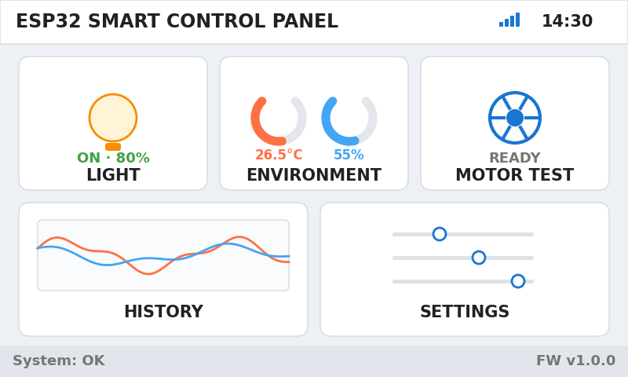
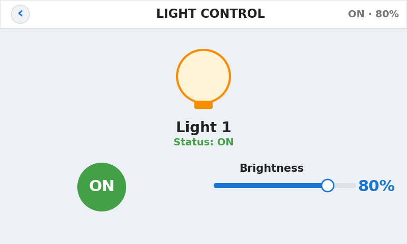
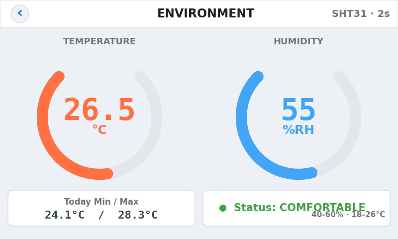
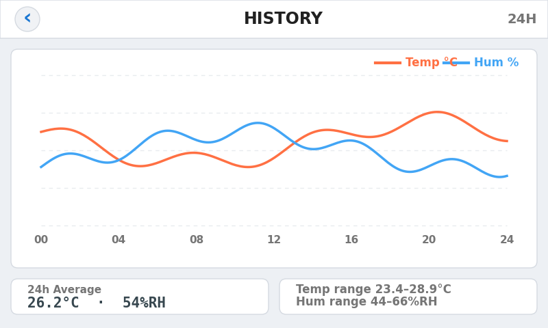
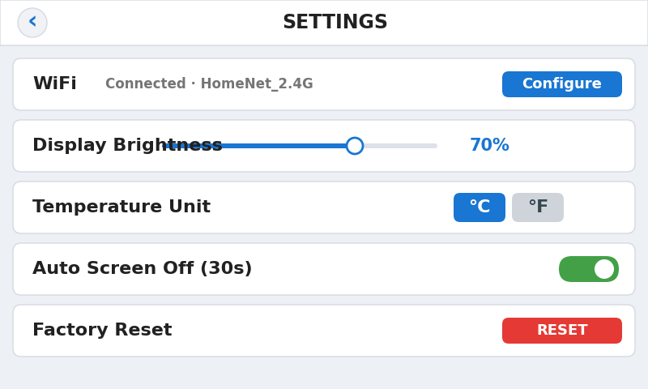

# Mult_RollCoaterHMI — LVGL Touch HMI for a Roll Coater Height Axis

An 800×480 capacitive-touch HMI running on an ESP32-S3, controlling the **roll
coat height axis** of a roll-coating machine: target entry, validated motion,
limit handling, alarms, plus light control, environment monitoring and Wi-Fi
provisioning.

Built with **ESP-IDF (≥ 5.1, validated on 5.5.1) + LVGL 8.3** on top of a
parallel RGB panel, with all machine parameters persisted in NVS.

---

## Screens

| Main menu | Light control | Environment |
|---|---|---|
|  |  |  |

| History | Settings |
|---|---|
|  |  |

```
MAIN MENU
 ├─ LIGHT CONTROL   lamp on/off + brightness (0–100 %)
 ├─ ENVIRONMENT     SHT30/31 temperature & humidity, comfort state, daily extremes
 ├─ MOTOR TEST      ← the core page: position readout, numeric keypad, STOP
 │     └─ long-press Enter 3 s → Admin parameter screen
 ├─ HISTORY         24 h temperature/humidity curve (288 points) + mean/min/max
 └─ SETTINGS        Wi-Fi, backlight, temperature unit, auto screen-off, factory reset
        └─ WIFI SETUP   scan / connect / forget network
Modal popups: alarm, confirmation, "resetting" (drawn on `lv_layer_top()`)
```

> Older notes in `main/ui_menu.h` and `main/README.md` say only MOTOR TEST is
> implemented and the other cards are placeholders. **That is out of date** —
> `ui_menu.c` dispatches to all of them and every `*_show()` exists.

---

## State machine

| State | Purpose |
|---|---|
| **State1** | Enter the actual roll coat height (dial reading) |
| **State2** | Enter the target height, validate against limits, command the axis |
| **State3** | Out-of-limit: confirmation popup + manual jog back inside the limits |
| **Admin** | Enter `9.999` and hold Enter for 3 s to reach the parameter screen |
| **Alarm** | Latched once active; requires a manual ACK |

Admin exposes seven machine parameters: upper limit, lower limit, acceleration,
deceleration, speed, current position and backlash compensation — all persisted
in NVS and validated against user-configurable ranges.

---

## Hardware

| Item | Detail |
|---|---|
| MCU | **ESP32-S3R8** — 8 MB flash, 8 MB octal PSRAM |
| Display | **800×480 RGB565 parallel RGB (16-bit)**, no display controller IC — driven straight from the LCD peripheral |
| Touch | **GT911** capacitive, I²C0, **SDA 19 / SCL 20** @ 100 kHz, address `0x5D` (backup `0x14`) |
| Panel data | DATA0..15 = `8,3,46,9,1,5,6,7,15,16,4,45,48,47,21,14` |
| Panel sync | VSYNC 41, HSYNC 39, DE 40, backlight GPIO2 (LEDC PWM) |
| Panel timing | HSYNC/VSYNC pulse 4, porches 8, total 820×500; PCLK 18 MHz (~44 Hz) by default |
| Stepper | **STEP GPIO11 / DIR GPIO12 / ENA GPIO13** (active-low); alarm input disabled (`-1`) |
| Driver | TB6600 with a 42BL233 two-phase stepper (no encoder feedback) |
| Mechanics | **800 steps/mm** (1600 pulses/rev ÷ 2 mm lead); typical cruise 12000 Hz = 15 mm/s |
| Light | **GPIO10**, active-high, LEDC 1 kHz / 10-bit |
| Environment | SHT30/SHT31 on I²C0, address `0x44`, shared with the touch bus |
| Connectivity | Wi-Fi (STA) + SNTP time, UART0 debug CLI — no Modbus/RS485/CAN/PLC |

### Supported boards

Selected in menuconfig (`CONFIG_ROLLCOATER_BOARD_*`), pins live in
**`main/bsp_pins.h`** — "change screen or board, edit only this file":

| Board | Note |
|---|---|
| **JC8048W550 / ESP32-8048S050** | default; PCLK on GPIO42 |
| **Elecrow CrowPanel 5.0** | PCLK on GPIO0 |
| Touch alternative | AXS15231 (I²C `0x3B`, extra component required) |

### ⚠️ Wiring constraints

* **GPIO19/20 double as USB D-/D+** → flash through the on-board UART only.
* **PCLK / DE / VSYNC / HSYNC are JTAG pins** → JTAG is unusable once the
  display is connected.
* The SHT30 shares I²C0 with the touch controller; keep the bus short and check
  addresses if the touch stops responding.

---

## Building

```bash
idf.py set-target esp32s3     # first time only
idf.py build
idf.py -p COM7 flash monitor
```

* The project was renamed from `RollCoaterHMI`, so a stale `build/` will fail on
  path mismatch — run `idf.py fullclean`, or use a fresh build directory
  (`idf.py -B build_x build`).
* `main/idf_component.yml` pulls `lvgl/lvgl ~8.3.0` and
  `espressif/esp_lvgl_port ^2.0`, and `espressif/esp_lcd_touch_gt911 ^1`.
* Non-default settings live in `sdkconfig.defaults`: 8 MB flash / QIO / 80 MHz,
  custom partition table, 240 MHz CPU + 64 KB data cache, octal PSRAM, LVGL
  16-bit colour, `CONFIG_ROLLCOATER_BOARD_JC8048W550`, GT911 touch,
  `STEPS_PER_UNIT=800`.

**Partition table** (`partitions.csv`):

```
nvs        0x9000     24 KB
phy_init   0xF000      4 KB
factory   0x10000      4 MB
```

---

## menuconfig options

| Option | Default | Note |
|---|---|---|
| `ROLLCOATER_BOARD_*` / `ROLLCOATER_TOUCH_*` | JC8048W550 / GT911 | board + touch choice |
| `MOTION_SIMULATE` | **y** | run the motion logic without hardware |
| `MOTION_WIRE_TEST` | n | bare pulse output for wiring checks |
| `MOTION_CONSOLE` | n | serial motor CLI (`mtest`) — **must be off for delivery** |
| `MOTION_SELFTEST` / `BOOT_HOLD` | n | step-loss self-tests / boot-hold behaviour |
| `STEPS_PER_UNIT` | 800 | steps per mm (range 20–5000) |
| `STEP_PULSE_US` | 0 | extra pulse width if the driver needs it |
| `SOFT_START_HZ` | — | start frequency for smooth acceleration |
| `ENA_SETTLE_MS` | 100 | settle delay after enabling the driver |
| `LCD_PCLK_MHZ` | 16 | raise for less flicker if the panel tolerates it |
| `UI_PUSH_MS` | — | UI refresh cadence |

---

## Repository layout

```
main/
  main.c                 application entry, initialisation order
  bsp_display.c/.h       RGB panel + touch + LVGL port (incl. image tuning)
  bsp_pins.h             all board-level pins & timing macros
  app_motion.c/.h        motion core: RMT/LEDC pulses, trapezoidal profile,
                         alarms, self-tests, serial motor CLI
  app_state.c/.h         State1/2/3 + Admin + Alarm state machine
  app_config.c/.h        machine parameters + NVS persistence
  app_settings.c/.h      UI preferences (backlight, unit, screen-off), NVS
  app_light.c/.h         lamp GPIO + LEDC PWM
  app_sensor.c/.h        SHT30/31 sampling + 24 h history buffer
  app_wifi.c/.h          Wi-Fi provisioning + SNTP
  app_text.h             every UI string, centralised (easy to localise)
  stepper_motor_encoder.c/.h  encoder helper copied from the IDF example
  ui_theme.c/.h          visual constants, fonts, widget factories
  ui_subpage.c/.h        shared sub-page chrome (top bar, back, gestures, bars)
  ui_menu.c/.h           main menu               ui_main.c/.h   MOTOR TEST
  ui_admin.c/.h          Admin parameters         ui_numpad.c/.h numeric keypad
  ui_light.c/.h          LIGHT CONTROL            ui_env.c/.h    ENVIRONMENT
  ui_history.c/.h        HISTORY                  ui_settings.c/.h SETTINGS
  ui_wifi.c/.h           WIFI SETUP               ui_popup.c/.h  modal layer
  ui_fonts.h / ui.h      font declarations / SquareLine include shim
  fonts/                 Lato Bold subsets: 50 / 42 / 35 / 24 px
  Kconfig.projbuild      all menuconfig options
```

All icons are drawn with LVGL primitives — there is no image asset directory.
The `fonts/*.c` files are character subsets exported from a SquareLine project.

**Extensive Chinese documentation ships with the code**: `main/README.md`
(~140 KB: flashing, blank-screen troubleshooting, task model, state machine,
parameter/NVS reference, test checklist, wiring, motor-not-turning checklist)
plus `AGENTS.md` and `MULTI_SCREEN_UI_GUIDE.md`.

---

## Notes

* **No hardcoded credentials** — Wi-Fi settings are entered by the user and
  stored in NVS (namespace `rc_wifi`).
* `sdkconfig` is committed on purpose: it captures the exact verified board
  configuration (`sdkconfig.defaults` holds the important settings if you would
  rather regenerate it).
* Motion is command-based, not closed-loop: the axis has no encoder, so position
  accuracy depends on `STEPS_PER_UNIT` calibration and the backlash
  compensation parameter.

---

## License & contact

Provided as a working reference for ESP32-S3 touch HMI products. Adapt
`bsp_pins.h` and the partition table to your own board.

**Need an embedded touch UI (LVGL), ESP-IDF firmware, or motion-control
integration built for your product?**
→ Reach me on Upwork: `https://www.upwork.com/freelancers/~YOUR_PROFILE_ID`
